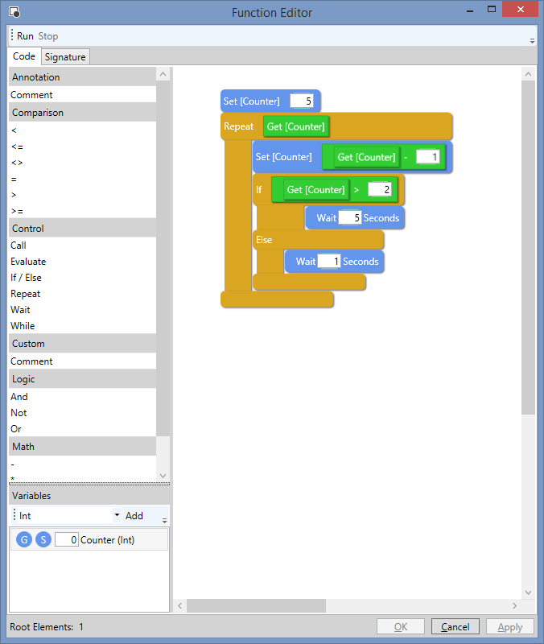

# Visual Programming Language
A simple, extensible VPL based around a plugin architecture.



# Using VPL

Install the "CaptiveAire.VPL" nuget package.

```c#
//Create the system plugins
var plugins = SystemPluginFactory.CreateAllPlugins();

//Create the vplService
var vplService = new VplService(plugins);
```

To edit / run a function:

```c#
//Create new function metadata
var functionMetadata = new FunctionMetadata() 
{
    Id = Guid.NewGuid(),
    Name = "My Function"
};

//Edit the function (providing an action that will persist the function)
vplService.EditFunction(functionMetadata, f => SaveFunction(f))
```

# Calling Functions
To call functions, you must provide an implementation of IFunctionService and include this in your plugin services.

There is no default implementation of IFunctionService 

# Creating a Plugin
Plugins can provide the following:
* Custom Elements
* Custom data types (via the IVplType interface / VplType class)
* Provide WPF resources such as styles and control templates.

A simple 'Alert' statement:
```c#
public class Alert : Statement
{
    private readonly IParameter _messageParameter;

    public Alert(IElementCreationContext context) : base(context)
    {
        _messageParameter = context.Owner.CreateParameter("message", context.Owner.GetStringType());

        Parameters.Add(_messageParameter);
    }

    public override object Label
    {
        get { return "Alert"; }
        set {  }
    }

    protected override async Task ExecuteCoreAsync(CancellationToken cancellationToken)
    {
        var message = await _messageParameter.EvaluateAsync(cancellationToken) as string;

        MessageBox.Show(message);
    }
}
```

Then, create the plugin:
```c#
var alertPlugin = new VplPlugin("Alert",
                new IElementFactory[]
                {
                    new ElementFactory(
                        new Guid("FBB6804C-B90C-4A88-B28B-8B733C1A9F0D"), 
                        "Interaction", 
                        "Alert", 
                        context => new Alert(context), 
                        typeof(Alert)), 
                });
```

Add this to the list of plugins when creating the vpl sevice.

```c#

//Create the system plugins
var plugins = SystemPluginFactory.CreateAllPlugins().ToList();

plugins.Add(alertPlugin)

//Create the vplService
var vplService = new VplService(plugins);
```

Now, drag out an Alert statement and add some text for the message:

